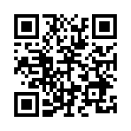

# PWA-CAMERA
https://mu-tomoya.github.io/pwa-camera/#/



#注意
PWAでカメラアプリを作ろうとしたところ、Safariでは動いたけれど、
肝心のPWAでは動きませんでした。試す際はそこだけ注意してください。
2018年7月現在の失敗作です。

Qiita記事
https://qiita.com/mu_tomoya/items/d35dbb580a561c562ca6

# Project
フレームワーク　Vue.js
```bash

# yarnインストール
npm -g install yarn

# モジュールインストール
yarn

# dev
yarn dev

# build
yarn build


```
